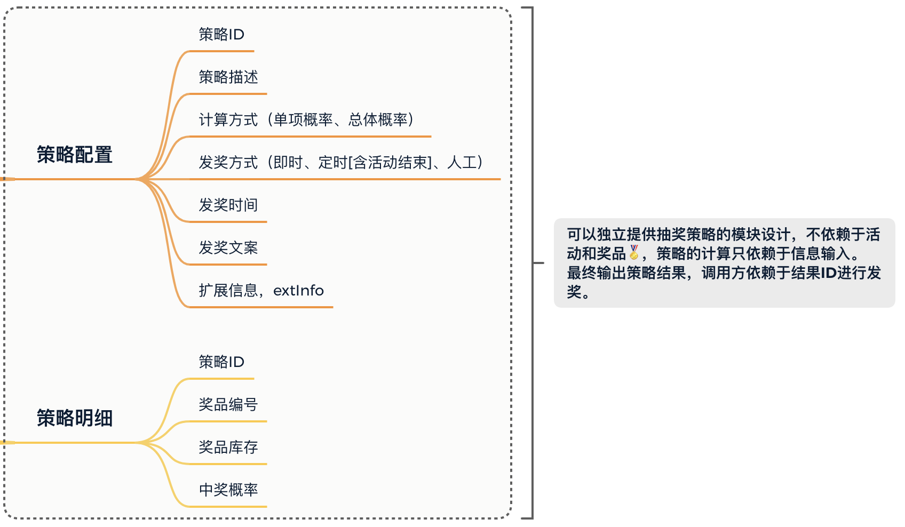
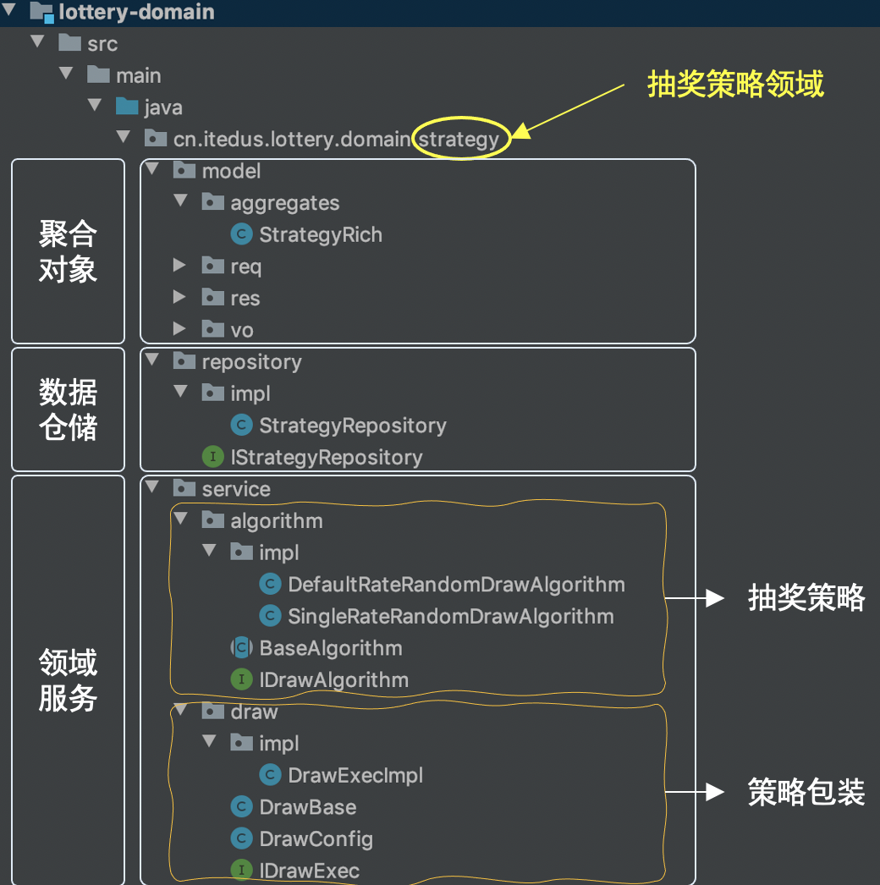
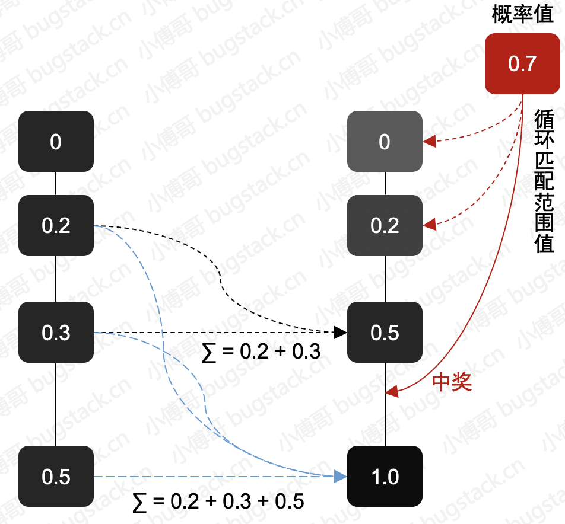

# 抽奖策略领域模块开发
在做抽奖领域模块设计时，就要考虑到库表中要有对应的字段来区分当前运营选择的是什么样的抽奖策略。那么在开发实现上也会用到对应的策略模式的使用，两种抽奖算法可以算是不同的抽奖策略，最终提供统一的接口包装满足不同的抽奖功能调用。

例如在转盘中配置12个奖品，每个奖品配置不同的中奖概率，当1个奖品被抽空了以后，那么再抽奖时，是剩余的奖品总概率均匀分配在11个奖品上，还是保持剩余11个奖品的中奖概率，如果抽到为空的奖品则表示未中奖。

* 策略配置和策略明细，它们的关系是1vn。
* 抽奖策略可成为独立配置和使用的领域模块，在策略表用不引入活动ID信息的配置
* 通过这样的设计实现，就可以满足于不同业务场景的灵活调用
## 结构
domain为专门用于开发领域服务的模块，不限于目前的抽奖策略在此模块下实现还有以后需要实现的活动领域、规则引擎、用户服务等都需要在这个模块实现对应的领域功能。


* model，用于提供vo、req、res 和 aggregates 聚合对象。
* repository，提供仓储服务，其实也就是对Mysql、Redis等数据的统一包装。
* service，是具体的业务领域逻辑实现层，在这个包下定义了algorithm抽奖算法实现和具体的抽奖策略包装 draw 层，对外提供抽奖接口 IDrawExec#doDrawExec
## 抽奖算法实现
总体概率：当奖品被抽取，概率实时改变
单项概率：当奖品被抽取，中奖概率保持不变，当奖品抽空，则显示未中奖

### 1. 定义两种算法统一接口
无论哪种抽奖算法都使用这个接口作为抽奖接口进行抽奖
```java
public interface IDrawAlgorithm {
    /**
     * SecureRandom 生成随机数，索引到对应的奖品信息返回结果
     *
     * @param strategyId 策略ID
     * @param excludeAwardIds 排除掉已经不能作为抽奖的奖品ID，留给风控和空库存使用
     * @return 中奖结果
     */
    String randomDraw(Long strategyId, List<String> excludeAwardIds);
    /**
     * 程序启动时初始化概率元祖，在初始化完成后使用过程中不允许修改元祖数据
     * <p>
     * 元祖数据作用在于讲百分比内(0.2、0.3、0.5)的数据，转换为一整条数组上分区数据，如下；
     * 0.2 = 0 ~ 0.2
     * 0.3 = 0 + 0.2 ~ 0.2 + 0.3 = 0.2 ~ 0.5
     * 0.5 = 0.5 ~ 1 （计算方式同上）
     * <p>
     * 通过数据拆分为整条后，再根据0-100中各个区间的奖品信息，使用斐波那契散列计算出索引位置，把奖品数据存放到元祖中。比如：
     * <p>
     * 1. 把 0.2 转换为 20
     * 2. 20 对应的斐波那契值哈希值：（20 * HASH_INCREMENT + HASH_INCREMENT）= -1549107828 HASH_INCREMENT = 0x61c88647
     * 3. 再通过哈希值计算索引位置：hashCode & (rateTuple.length - 1) = 12
     * 4. 那么tup[14] = 0.2 中奖概率对应的奖品
     * 5. 当后续通过随机数获取到1-100的值后，可以直接定位到对应的奖品信息，通过这样的方式把轮训算奖的时间复杂度从O(n) 降低到 0(1)
     *
     * @param strategyId        策略ID
     * @param awardRateInfoList 奖品概率配置集合 「值示例：AwardRateInfo.awardRate = 0.04」
     */
    void initRateTuple(Long strategyId, List<AwardRateInfo> awardRateInfoList);

    /**
     * 判断是否已经，做了数据初始化
     * @param strategyId
     * @return
     */
    boolean isExistRateTuple(Long strategyId);
}
```
### 2. 总体概率算法

* 首先要从总的中奖列表中排除掉那些被排除掉的奖品，这些奖品会涉及到概率的值重新计算。
* 如果排除后剩下的奖品列表小于等于1，则可以直接返回对应信息
* 接下来就使用随机数工具生产一个100内的随值与奖品列表中的值进行循环比对，算法时间复杂度O(n)

### 3. 单项概率算法
根据概率值将商品Id存放在自定义散列数组中，根据概率值的hash值作为索引直接查找到该商品
